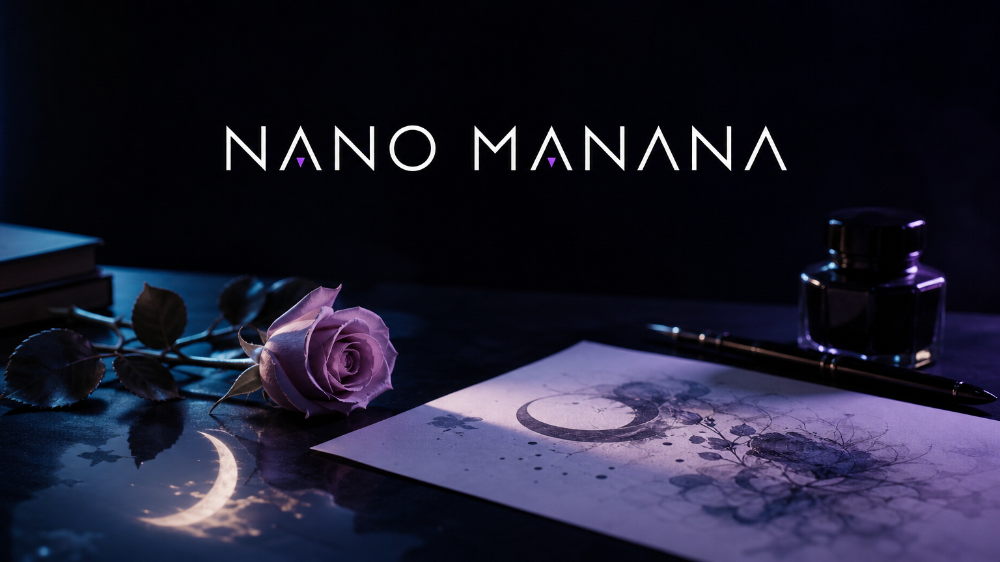
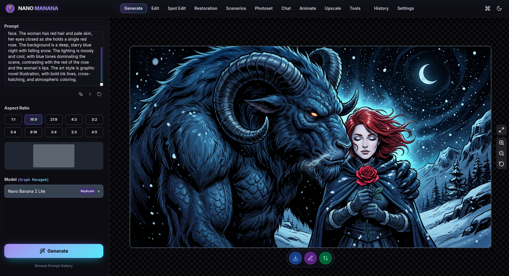
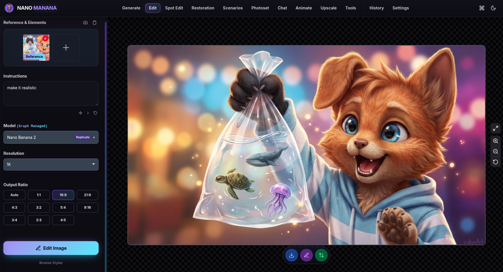
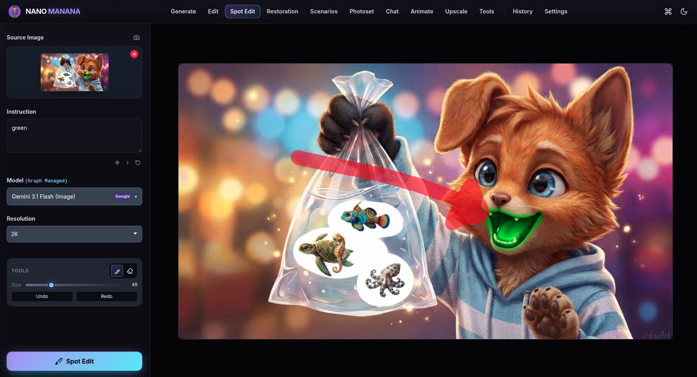

  

  <strong>A desktop workstation for AI images and video.</strong> 
  Google Gemini and Replicate, one node graph, your own API keys.

  
  

Nano Manana is a desktop creative desk. Generate, edit, restore, animate, and upscale without hopping between vendor sites. You bring the keys. The app keeps the workflow, the history, and the routing.

This repository ships **built Electron apps only**. Source is not published here.

## Download

Latest release: **[v0.2.91](https://github.com/stark1ng/nano-manana/releases/tag/v0.2.91)**

| Platform | File | Use it when |
| --- | --- | --- |
| Windows | [Nano.Manana.Setup.0.2.91.exe](https://github.com/stark1ng/nano-manana/releases/download/v0.2.91/Nano.Manana.Setup.0.2.91.exe) | You want a normal install |
| Windows | [Nano.Manana.0.2.91.exe](https://github.com/stark1ng/nano-manana/releases/download/v0.2.91/Nano.Manana.0.2.91.exe) | You want a portable build |
| Linux | [Nano.Manana-0.2.91.AppImage](https://github.com/stark1ng/nano-manana/releases/download/v0.2.91/Nano.Manana-0.2.91.AppImage) | Any distro. `chmod +x` and run |
| Linux | [nano-manana_0.2.91_amd64.deb](https://github.com/stark1ng/nano-manana/releases/download/v0.2.91/nano-manana_0.2.91_amd64.deb) | Debian, Ubuntu, Mint |

## The desk

  

**Generate.** Prompt, aspect ratio, model. The result stays on a checkerboard canvas with download, edit, and send-on actions.

  

**Edit.** Drop a reference, write the change, pick the output ratio.

  

**Spot Edit.** Paint the region. The rest of the picture stays put.

The same shell also holds Restoration, Scenarios, Photoset, Chat, Animate, Upscale, Tools, and History.

## What 0.2.91 changes

Last public build was **v0.1.94**. This one is the current desk.

- **Obsidian** is the skin on a fresh start and after Reset settings. Classic, Modern, and Lando are still in Appearance.
- **Main** is the default Node API profile when nothing is saved yet. Google and Replicate are already wired. Every catalog model for those two providers is connected to the section it belongs to. Labels are in English.
- **Magic Prompt** is in that profile: Gemini 2.5 Flash in, and out to Generate, Edit, Photoset, Scenarios, Animate, and Upscale.
- Windows installer, Windows portable, Linux AppImage, and Debian package are all in this release.

## Connect an API

You need a network connection and at least one key.

1. On first launch, pick a folder if you want settings and history on disk. You can skip it and stay in the app.
2. Open **Node API**. The Main profile is the starting map.
3. Click the **Google** provider and paste a key from [Google AI Studio](https://aistudio.google.com/).
4. Click the **Replicate** provider and paste a token from [replicate.com/account/api-tokens](https://replicate.com/account/api-tokens).
5. Press **Active**. Sections then list only the models wired in the graph.

**API Pocket** stores extra keys so you can load one onto a provider node instead of retyping it.

Google covers image, chat, and Veo. Replicate covers Nano Banana, Ideogram-class generate, video, and the upscale list. Local and Vertex are not in the default profile.

## Requirements

- Windows 10/11 x64, or a current 64-bit Linux desktop
- Internet access while you generate
- A Google AI Studio key
- A Replicate token if you want those models

## License

Nano Manana is freeware for personal and commercial use. The source is not part of this repository. Redistribution of modified builds is not permitted. See the app license on first launch.
